# COVID-19 Sentiment Analysis

## Project Background
The project implementation consists of the following methods:
1. A data pre-processing methodology to get rid of symbols and stopwords.
2. A convolutional neural network (CNN) to train the model to classify social media posts based on categories ("medical research", "social events", "pandemic data", "administrative policy").
3. Accuracy plots for each epoch 

## Project Goal
The goal of this project was to... Explain the goal.

This project began in XXXX, and is still ongoing/ended in XXXX/etc.

Please contact Zifu Wang with questions about this project.

Please see the detailed implementation guidance provided below or download it as a [pdf](./README.pdf).

- [COVID-19 Sentiment Analysis](#covid-19-sentiment-analysis)
  - [Project Background](#project-background)
  - [Project Goal](#project-goal)
- [1. Implementation Guidance](#1-implementation-guidance)
  - [1.1 Data Understanding](#11-data-understanding)
  - [1.2 Overall Training Dataset](#12-overall-training-dataset)
  - [1.3 Computing Platforms](#13-computing-platforms)
    - [**A: 1.3.0 Windows Laptop with Graphics Card**](#a-130-windows-laptop-with-graphics-card)
    - [**B: 1.3.1 AWS g4dn instance with NVIDIA Tesla T4**](#b-131-aws-g4dn-instance-with-nvidia-tesla-t4)
    - [**C: 1.3.2 Windows Laptop with Intel Core i7-8550U CPU**](#c-132-windows-laptop-with-intel-core-i7-8550u-cpu)
    - [**D: 1.3.3 Ubuntu on Windows 10**](#d-133-ubuntu-on-windows-10)
    - [**E: 1.3.4 AWS Deep Learning Ubuntu 18.04 LTS**](#e-134-aws-deep-learning-ubuntu-1804-lts)
- [2. Demystifying the Code](#2-demystifying-the-code)
  - [2.1 Script](#21-script)
    - [**2.1.0 Script Segment**](#210-script-segment)
    - [**2.1.1 Model Output**](#211-model-output)
    - [**2.1.2 Interpretting the Model Output**](#212-interpretting-the-model-output)
- [Videos](#videos)
  - [Walkthrough video for AWS Ubuntu Server multi-GPU instance](#walkthrough-video-for-aws-ubuntu-server-multi-gpu-instance)
  - [Walkthrough Video for AWS Windows g4dn instance - Multi GPU](#walkthrough-video-for-aws-windows-g4dn-instance---multi-gpu)
  - [Walkthrough Video for Windows Laptop with Intel Core i7-8550U CPU](#walkthrough-video-for-windows-laptop-with-intel-core-i7-8550u-cpu)

# 1. Implementation Guidance

## 1.1 Data Understanding
Data Understanding section on how the data was obtained. 

## 1.2 Overall Training Dataset 
What does the training dataset look like? What does it encompass?

## 1.3 Computing Platforms

The tweet classification is tested in five computing platforms.\
  &emsp; (A) [Windows Laptop with Graphics Card](#a-130-windows-laptop-with-graphics-card)\
  &emsp; (B) [AWS Windows g4dn instance with 4 NVIDIA Tesla T4](#b-131-aws-g4dn-instance-with-nvidia-tesla-t4)\
  &emsp; (C) [Windows Laptop with Intel Core i7-8550U CPU](#c-132-windows-laptop-with-intel-core-i7-8550u-cpu)\
  &emsp; (D) [Ubuntu on Windows 10](#d-133-ubuntu-on-windows-10)\
  &emsp; (E) [AWS Deep Learning Ubuntu 18.04 LTS](#e-134-aws-deep-learning-ubuntu-1804-lts)

**Overview of Software Requirements**
|Open-source packages|Version|
| ---- | --------- |
|Python|3.8|
|NVIDIA|For Windows - 496.49|
|NVIDIA|For Ubuntu Server - 450.51.06|
|CUDA|11.0|
|TensorFlow|2.4.1|

### **A: 1.3.0 Windows Laptop with Graphics Card**

***A: 1.3.0.0 Check Graphic Card Details***

Go to Windows Start menu and type device manager. Then expand your Display Adapters, and your graphic cards will be displayed.

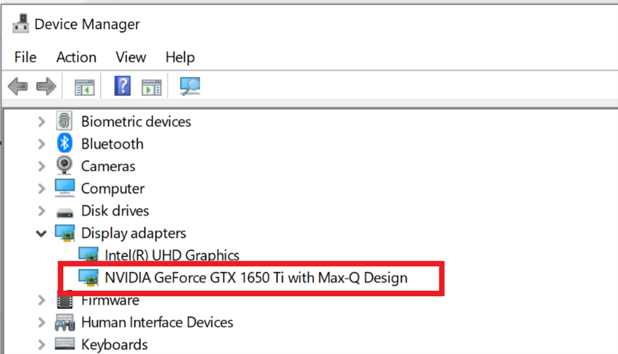

***A: 1.3.0.1 Download and Install the NVIDIA driver***

* Step 1: Use the [link](https://www.nvidia.com/Download/driverResults.aspx/183364/en-us) to download the NVIDIA driver.

* Step 2: Download the driver.

* Step 3: Install downloaded NVIDIA driver.

* Step 4: You will find CUDA subfolder inside “NVIDIA GPU computing toolkit” folder inside C drive “Program Files” folder (C:\Program Files\NVIDIA GPU Computing Toolkit).

***A: 1.3.0.2 CUDA Toolkit Installation***

* Step 1: [Go to CUDA Toolkit Archive.](https://developer.nvidia.com/cuda-toolkit-archive)

* Step 2: Find the CUDA Toolkit 11.0 version.

  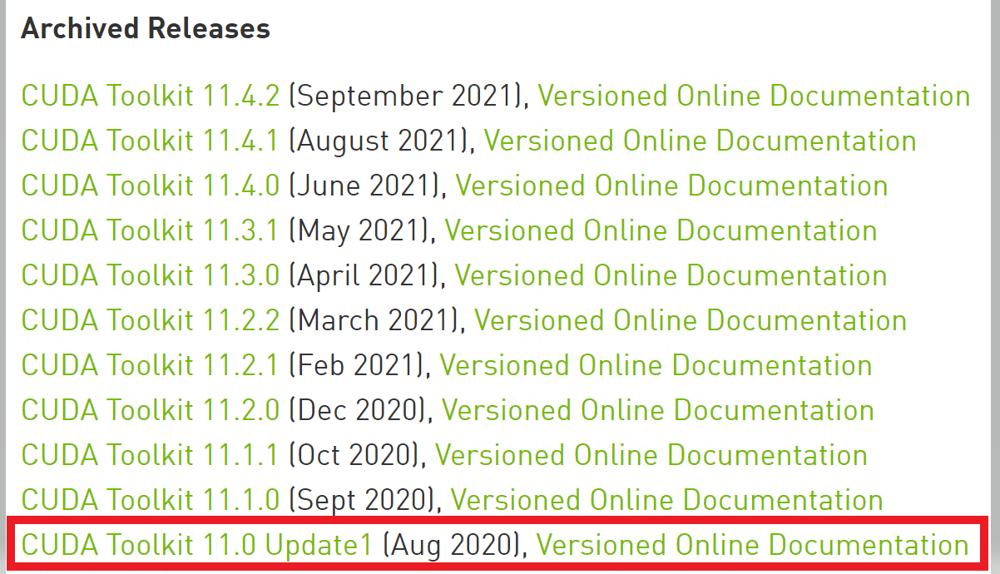

* Step 3: Select the Operating System (Linux or Windows), architecture, and version based on your machine preference.

  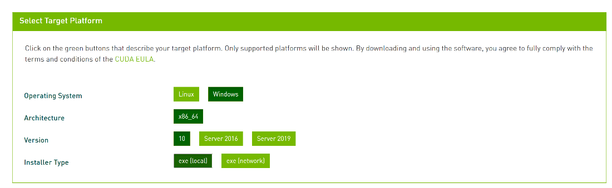

* Step 4: Click download.

* Step 5: Double click the downloaded exe file (Example: cuda_11.0.2_451.48_win10.exe) and follow the on-screen prompts.

***A: 1.3.0.3 Download cuDNN***

* Step 1: [Go to the cuDNN link.](https://developer.nvidia.com/cudnn)

* Step 2: Click Download cuDNN. If you are a first-time user, you need to create a user account and consent to the cuDNN Software License Agreement.

* Step 3: Select the right version of cuDNN. Please note that the version of CUDA and cuDNN should match. In this case, I download cuDNN version 8.0.5 for CUDA 11.0.

* Step 4: It will download as a compressed folder. Extract the compressed folder.

* Step 5: The extracted folder has “cuda” subfolder that matches with the “CUDA” subfolder in C:\Program Files\NVIDIA GPU Computing Toolkit.

* Step 6: Now, copy cudnn64_8.dll from the bin of the extracted folder (C:\Users\anush\Downloads\cudnn-11.0-windows-x64-v8.0.5.39\cuda\bin) and paste it in the bin folder inside CUDA folder of NVIDIA GPU Computing Toolkit (C:\Program Files\NVIDIA GPU Computing Toolkit\CUDA\v11.0\bin).

* Step 7: Copy cudnn.h file from include of the extracted folder (C:\Users\anush\Downloads\cudnn-11.0-windows-x64-v8.0.5.39\cuda\include) and paste it in the bin folder inside CUDA folder of NVIDIA_GPU_Computing Toolkit (C:\Program Files\NVIDIA GPU Computing Toolkit\CUDA\v11.0\include).

* Step 8: Copy cudnn.lib file from lib/x64 folder inside extracted folder (C:\Users\anush\Downloads\cudnn-11.0-windows-x64-v8.0.5.39\cuda\lib\x64) and paste it in the similar folder of NVIDIA_GPU_Computing_Tookit (C:\Program Files\NVIDIA GPU Computing Toolkit\CUDA\v11.0\lib\x64).

***A: 1.3.0.4 Clone the Covid-19 sentiment analysis repository and download training data***

* Step 1: Go to Start menu. Open command prompt. Use below command to create a new directory for Covid19SentimentAnalysis. Name it as per your preference. Then, navigate to the directory.

```
mkdir Covid19SentimentAnalysis
```

```
cd Covid19SentimentAnalysis
```

* Step 2: Clone or download the [repository](https://github.com/stccenter/Covid-19SentimentAnalysis).

* Step 3: From the cloned repository, copy requirements.txt, tweets_classification.py, tweets_classification_multi_GPU.py, and training_data_set_unduplicate.csv files from the cloned folder and paste them inside Covid19SentimentAnalysis folder.

* Step 4: Download [GoogleNews-vectors-negative300.bin](https://drive.google.com/file/d/0B7XkCwpI5KDYNlNUTTlSS21pQmM/edit?resourcekey=0-wjGZdNAUop6WykTtMip30g). This will need to be unzipped using 7-Zip. Then place the unzipped .bin file inside the Covid19SentimentAnalysis folder.


***A: 1.3.0.5 Create conda virtual environment***

**Note:** Please make sure you have Python 3.8 and Anaconda installed in your system.

* Step 1: In your terminal, create conda virtual environment using below command:

```
conda create --name sentimentanalysis-env python=3.8
```

* Step 2: Activate conda environment

```
conda activate sentimentanalysis-env
```

***A: 1.3.0.5 Install python packages***

* Step 1: In the command prompt, use the below command to install the required packages:

```
pip install -r requirements.txt
```

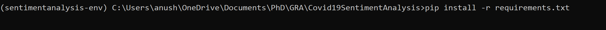

***A: 1.3.0.4 Verify GPU***

To verify your GPU is successfully installed, type python in your terminal:

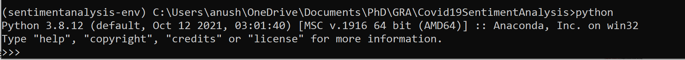

Type below command in Python terminal. This will print off any GPU devices currently active on the machine.

```
from tensorflow.python.client import device_lib
print(device_lib.list_local_devices())
```

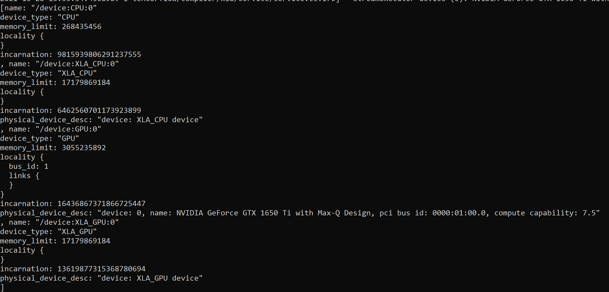

Type exit() to exit the python shell.

***A: 1.3.0.5 Run the script***

```
set CUDA_VISIBLE_DEVICES=0 & python tweets_classification_multi_GPU.py
```

***A: 1.3.0.9 Execution time***

The total time for execution is 46.34 seconds.

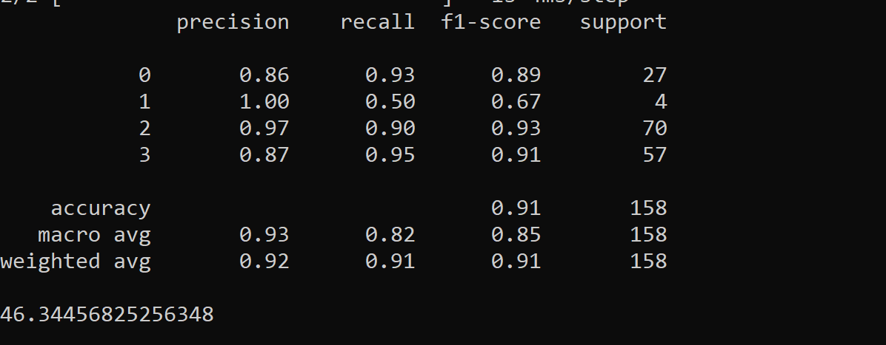

It should also display model accuracy graph similar to this:

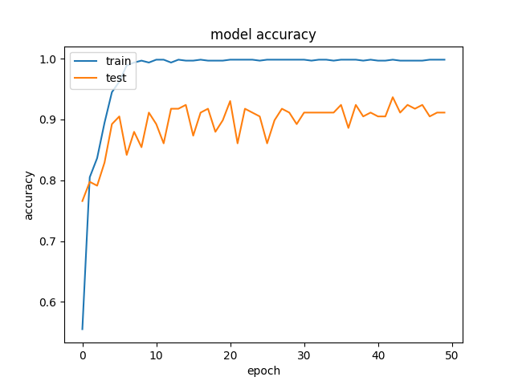


### **B: 1.3.1 AWS g4dn instance with NVIDIA Tesla T4**

***B: 1.3.1.0 Download and Install the NVIDIA driver***

The following steps are based on [AWS help document](https://docs.aws.amazon.com/AWSEC2/latest/WindowsGuide/install-nvidia-driver.html#nvidia-GRID-driver) to install NVIDIA driver in g4dn instance.

* Step 1: Connect to the Windows instance. Then, go to the Start menu, and open a Powershell Window. Copy and paste the below command. This command will download the driver inside of the Desktop.

```
  $Bucket = "ec2-windows-nvidia-drivers"
  $LocalPath = "$home\Desktop\NVIDIA"
  $Objects = Get-S3Object -BucketName $Bucket -KeyPrefix $KeyPrefix -Region us-east-1
  foreach ($Object in $Objects) {
    $LocalFileName = $Object.Key
    if ($LocalFileName -ne '' -and $Object.Size -ne 0) {
        $LocalFilePath = Join-Path $LocalPath $LocalFileName
        Copy-S3Object -BucketName $Bucket -Key $Object.Key -LocalFile $LocalFilePath -Region us-east-1
    }
}
```

* Step 2: Navigate to the desktop -> NVIDIA (folder) -> grid-13.0.

* Step 3: Double-click the installation file 471.68_grid_win10_server2016_server2019_server-aws-swl.exe to launch the installation process. Follow the instructions to successfully install the driver.

* Step 4: Reboot your instance.

* Step 5: Verify the GPU is working properly by checking the Device Manager. Go to the Start menu and search for the Device Manager. Then, expand the section "Display adapters".

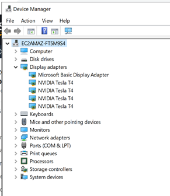

* Step 6: Optional
```
New-ItemProperty -Path "HKLM:\SOFTWARE\NVIDIA Corporation\Global\GridLicensing" -Name "NvCplDisableManageLicensePage" -PropertyType "DWord" -Value "1"
```

***B: 1.3.1.1 Install CUDA 11.0***

* Step 1: [Go to CUDA Toolkit Archive.](https://developer.nvidia.com/cuda-toolkit-archive)

* Step 2: Select the CUDA Toolkit 11.0 Update1 from the list of Archived Releases.


* Step 3: Select the target platform. For operating system select Windows; for architecture select x86_64; for version select Server 2019, and for instance type: choose exe (local)

* Step 4*: Click download.

* Step 5: Double click the downloaded exe file and follow the on-screen prompts.

* Step 6: Reboot the instance.

***B: 1.3.1.2 Download cuDNN library***

* Step 1: Go to cuDNN [link](https://developer.nvidia.com/cudnn).

* Step 2: Click Download cuDNN. If you are a first-time user, you need to create a user account and consent to the cuDNN Software License Agreement.

* Step 3: Select Archived cuDNN Releases link. Select cuDNN v8.0.5 (November 9th, 2020), for CUDA 11.0.
 
* Step 4: Select cuDNN Library for Windows (x86)

* Step 5: Download the compressed folder and extract it.

* Step 6: The extracted folder has “cuda” subfolder that matches with the “CUDA” subfolder in C:\Program Files\NVIDIA GPU Computing Toolkit.

* Step 7: Now, copy all dll files from the bin of the extracted folder (C:\Users\Administrator\Downloads\cudnn-11.0-windows-x64-v8.0.5.39\cuda\bin) and paste it in the bin folder inside CUDA folder of NVIDIA GPU Computing Toolkit (C:\Program Files\NVIDIA GPU Computing Toolkit\CUDA\v11.0\bin).

* Step 8: Copy cudnn.h file from include of the extracted folder (C:\Users\Administrator\Downloads\cudnn-11.0-windows-x64-v8.0.5.39\cuda\include) and paste it in the include folder inside CUDA folder of NVIDIA_GPU_Computing Toolkit (C:\Program Files\NVIDIA GPU Computing Toolkit\CUDA\v11.0\include).

* Step 9: Copy cudnn.lib file from lib/x64 folder inside extracted folder (C:\Users\Administrator\Downloads\cudnn-11.0-windows-x64-v8.0.5.39\cuda\lib\x64) and paste it in the similar folder of NVIDIA_GPU_Computing_Tookit (C:\Program Files\NVIDIA GPU Computing Toolkit\CUDA\v11.0\lib\x64).

***B: 1.3.1.2 Set up the Virtual Environment***

* Step 1: Create a new project folder and name it as per your wish. For example, we will use "sentiment-analysis".

* Step 2: Go to the Start menu, and search for your "command prompt". Then, navigate to your project folder, changing the PATH as needed.
```
cd sentiment-analysis
```

* Step 3: Create and then activate your virtual environment using the code below. As per our example in Step 1, our environment is named sentiment-analysis.

***Creation***
```
  python -m venv sentiment-analysis
```

***Activation***
```
  sentiment-analysis\Scripts\activate.bat
```

***B: 1.3.1.4 Clone the project repository and download training data***


* Step 1: Clone or download the repository.

* Step 2: From the cloned repository, copy and paste the requirements.txt, tweets_classification_multi_GPU.py, and tweets_classification.py inside the sentiment-analysis directory.

* Step 3: Download [GoogleNews-vectors-negative300.bin](https://drive.google.com/file/d/0B7XkCwpI5KDYNlNUTTlSS21pQmM/edit?resourcekey=0-wjGZdNAUop6WykTtMip30g). This will need to be unzipped using 7-Zip. Then place the unzipped .bin file inside the sentiment-analysis folder.

* Step 4: Download the training_data_set_unduplicate.csv from the cloned repository and place it inside the sentiment-analysis folder.

***B: 1.3.1.5 Install Python Packages***

In the command prompt, paste the below code to install the necessary Python packages:
```
pip install -r requirements.txt
```

***B: 1.3.1.6 Run the script***

a.	For multi-GPU use below command to run the script.

```
set CUDA_VISIBLE_DEVICES=0,1,2,3 & python tweets_classification_multi_GPU.py
```

NVIDIA-SMI screenshot:

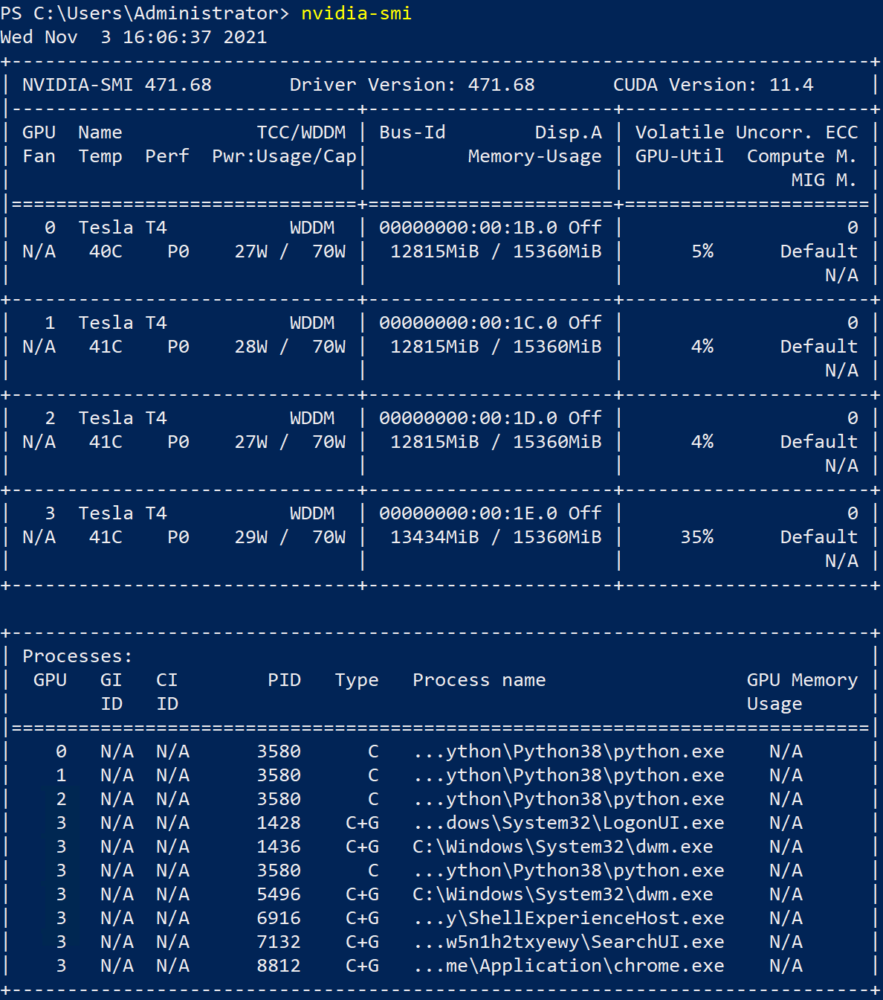

b.	For single-GPU use below command to run the script.

```
set CUDA_VISIBLE_DEVICES=0 & python tweets_classification_multi_GPU.py
```

**Note:**  You may get below error while running the script:

No OpKernel was registered to support Op 'NcclAllReduce, please change line #86 to strategy = tf.distribute.MirroredStrategy(cross_device_ops=tf.distribute.HierarchicalCopyAllReduce())

***B: 1.3.1.7 Execution time***

a. For 4 GPUs:
The total time for execution is 83.02 seconds.


b. For single GPU:
The total time for execution is 48.17 seconds.


### **C: 1.3.2 Windows Laptop with Intel Core i7-8550U CPU**

* Step 1:	Created a new folder and name it CovidSentimentAnalysis

* Step 2:	Download the zip file of the [Covid-19SentimentAnalysis](https://github.com/stccenter/Covid-19SentimentAnalysis) repository. 

* Step 3:	Once the zip file is downloaded, extract the folder and copy/paste each file into the CovidSentimentAnalysis folder

* Step 4: Download [GoogleNews-vectors-negative300.bin](https://drive.google.com/file/d/0B7XkCwpI5KDYNlNUTTlSS21pQmM/edit?resourcekey=0-wjGZdNAUop6WykTtMip30g). Once downloaded, you will need to install a software called 7-Zip in order to unzip the file.

* Step 5:	After installing 7-Zip, right click GoogleNews-vectors-negative300.bin and extract it to the bin. Once extracted, add this to the CovidSentimentAnalysis folder

* Step 6:	Open Command Prompt

* Step 7: Create virtual environment by typing:
  
```
python -m venv sentimentanalysis-env
```

* Step 8:	Activate the virtual environment by typing:
  
```
sentimentanalysis-env\Scripts\activate.bat
```

* Step 9:	Begin installing the packages for the requirements.txt file by typing:
  
```
pip install -r requirements.txt
```

* Step 10:	 Run the script for the tweets_classification.py by typing:
  
```
python tweets_classification.py
```

The script took approximately 30 seconds to run

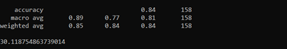

It should also display model accuracy graph similar to this:

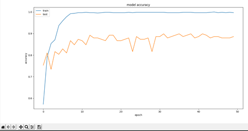


### **D: 1.3.3 Ubuntu on Windows 10**


*  **Step 1**: Create Conda Environment

Enter This command to create the conda environment:

```
conda create -n sentiment-env python=3.8
```

*  **Step 2**: Activate the Conda Environment

To activate the conda environment you created, enter this command:

```
conda activate sentiment-env
```

Followed by this command to install pip to the conda environment:

```
conda install pip
```

*  **Step 3**: Download the Training Data and Required python packages

Download the training data at this [link](https://drive.google.com/file/d/13W_etsy1A4czDTDHrPVliOImAfTlRSze/view) and place it in a folder named sentimentpackage on your desktop 

[Download the zip](https://github.com/stccenter/PM2.5Retrieval/archive/refs/heads/main.zip) containing your script and place the contents of the zip in the sentimentpackage folder 

To change to the desktop directory, Enter the Command: 

```
cd Desktop
```

To change to the directory to your folder, Enter the Command: 

```
cd sentimentpackage
```

Install the required packages using the command:

```
pip install -r requirements.txt
```

*  **Step 4**: Run the Script

To run the Script enter the command: 

```
python tweets_classification.py 
```

### **E: 1.3.4 AWS Deep Learning Ubuntu 18.04 LTS**

* Step 1 T:he AWS Deep Learning AMI comes with different versions of CUDA. Please switch to the correct CUDA version, **11.0**, by using the following commands:

```
sudo rm /usr/local/cuda
```
```
sudo ln -s /usr/local/cuda-11.0 /usr/local/cuda
```

After running both commands, verify your CUDA version by running NVIDIA's nvcc program:

```
nvcc --version
```

* Step 2: Create a folder inside your prefered directory in which you will store all the necessary files for the Tweets classification program. For the purposes of this guide, I will refer to this folder as 'Covid-19SentimentAnalysis'

* Step 3: Download [GoogleNews-vectors-negative300.bin](https://drive.google.com/file/d/0B7XkCwpI5KDYNlNUTTlSS21pQmM/edit?resourcekey=0-wjGZdNAUop6WykTtMip30g). This will need to be unzipped using 7-Zip. Then place the unzipped .bin file inside the sentiment-analysis folder.

* Step 4: Download the training_data_set_unduplicate.csv from the cloned repository and place it inside the sentiment-analysis folder.

* Step 5: Clone the Tweets classification repository. In your terminal type the below command:
```
git clone https://github.com/stccenter/Covid-19SentimentAnalysis
```
Copy requirements.txt, tweets_classification.py, and tweets_classification_multi_GPU.py files from the cloned folder and paste them inside Covid-19SentimentAnalysis folder.

* Step 6: Create a conda environment with the required Python version, 3.8, using the following command (you may name your conda environment however you like; for the purposes of this guide, I will use the name 'tweetclassify-env'):

```
conda create -n tweetclassify-env python=3.8
```

* Step 7: After you create your conda environment, activate it using the following command:

```
conda activate tweetclassify-env
```

* Step 8: Use the following command to install all of the necessary packages:

```
pip install -r requirements.txt
```

* Step 9: Run the tweet classification program using the following command:

**For single GPU**

```
CUDA_VISIBLE_DEVICES=0 python tweets_classification_multi_GPU.py.py
```

**For multi GPU**

```
CUDA_VISIBLE_DEVICES=0,1,2,3 python tweets_classification_multi_GPU.py.py
```


# 2. Demystifying the Code
What scripts will be gone over? Overview of all items.

## 2.1 Script
Script overview, a few sentences on what the program is meant to do.

### **2.1.0 Script Segment**
```
CODE
```

Explain code.


### **2.1.1 Model Output**
Describe the model output.

### **2.1.2 Interpretting the Model Output**
Interpret the model output.

# Videos

## Walkthrough video for AWS Ubuntu Server multi-GPU instance

[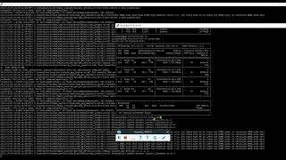](https://youtu.be/M-DYU5iHbMc)

## Walkthrough Video for AWS Windows g4dn instance - Multi GPU

## Walkthrough Video for Windows Laptop with Intel Core i7-8550U CPU

[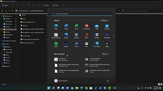](https://youtu.be/b-VxV0rkQ5U)


